<p align="center">
  
</p>

<br/>

```
$ cat ~/about.txt
```

I'm a second year computer science student at Trinity College Dublin with a strong interest in software engineering, cloud technologies, and AI/ML. I'm working on building practical skills in Python, Linux, Kubernetes and AWS to develop scalable solutions.

I enjoy collaborating with others and believe teamwork drives innovation. Whether leading a group project or contributing as a team member, I prioritise clear communication and reliability.

<br/>

```
$ ls -la ~/projects/
```

```
drwxr-xr-x  symptom-assessment-tool/  # Built during the Google Student AI Hackathon 2025
drwxr-xr-x  meeting-assistant/        # Developed during the Claude Code Hackathon 2025
drwxr-xr-x  WhereCanIAfford/          # Personal Project
drwxr-xr-x  whatsapp-assistant/       # Salon booking automation
-rw-r--r--  arrowglue.log             # Python, PostgreSQL, AWS S3, HTML, CSS
```

<br/>

```
$ present | grep "currently working on"
```

```
  287 Toast - Multi-Region Cloud Restaurant ordering system (SWEng Project)
  391 Learning Docker and Kubernetes 
```

<br/>

```
$ echo "why I code"
```

```
> Because I like building things people actually rely on.
```

<br/>

<p align="center">
  
</p>

<br/>

```
$ echo $CONTACT
```

<div align="center">
  <a href="mailto:devdeepak157@gmail.com" target="_blank">
    
  </a>

  <a href="https://www.linkedin.com/in/dev-joshi-083730273" target="_blank">
    
  </a>
</div>


<!---
DevEnjoysMath/DevEnjoysMath is a special repository: its README.md appears on your GitHub profile.
--->
